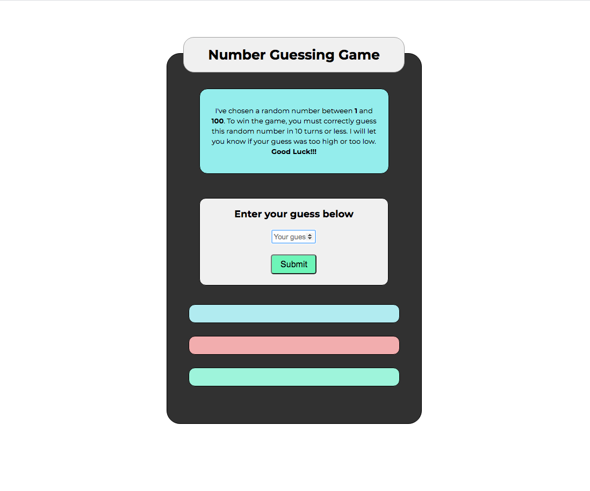

# Number Guessing Game

> This is a fun and simple JavaScript number guessing game

## Demo

Here's a working live demo of the project: https://julianehiem.github.io/number-guessing-game/

## Tech/framework used

- [HTML](https://developer.mozilla.org/en-US/docs/Web/HTML)
- [CSS](https://developer.mozilla.org/en-US/docs/Web/CSS)
- [JS](https://developer.mozilla.org/en-US/docs/Web/JavaScript)

## Links

- Repository: https://github.com/JulianEhiem/number-guessing-game

## License

This project is licensed under the terms of the **MIT** license.

MIT © [JulianEhiem](https://github.com/JulianEhiem)
